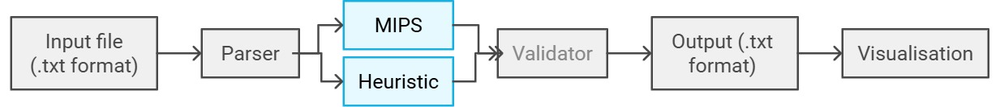
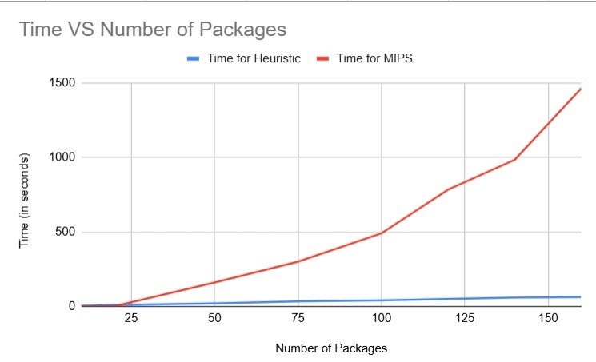
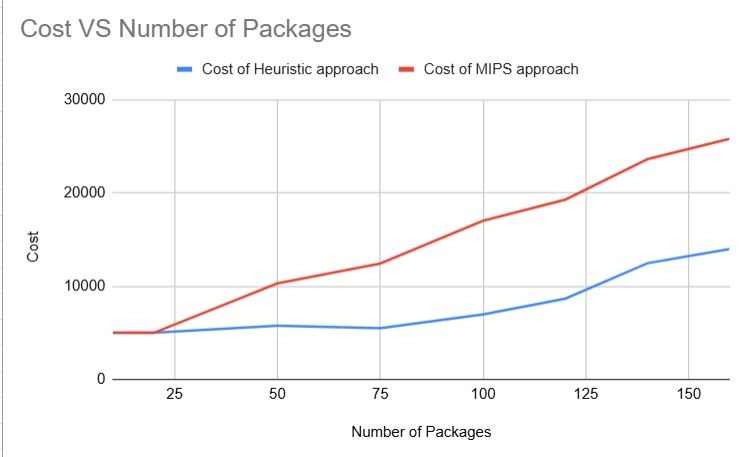
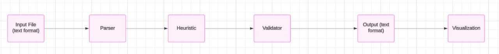

<h1 align = "center"> FedEx - Packaging Optimisation </h1>

<h2 id="content"> 📝 Contents </h2>

1.  [Optimization Problem Formulation for ULD Packing](#problem)
2.  [Approaches proposed](#solution)
3.  [Analysis](#Analysis)
4.  [Final Solution Flow](#solutionflow)
5.  [Usage Instructions](#usage)

---

<h2 id="problem"> Optimization Problem Formulation for ULD Packing </h2>

---

*Parameters:*

-   $n$: number of packages
-   $m$: number of ULDs
-   Package Dimensions: $l(i)$, $w(i)$, $h(i)$
-   Package Properties: $wt(i)$, $priority(i)$, $cost(i)$
-   ULD Dimensions: $L(i)$, $W(i)$, $H(i)$
-   ULD Properties: $WT(i)$

*Variables:*

-   $(x(i), y(i), z(i))$: front-left-bottom coordinates of package $i$
-   $(\_x(i), \_y(i), \_z(i))$: rear-right-top coordinates of package $i$
-   Boolean Variables:
    -   $Prio(j)$: ULD $j$ contains a priority package
    -   $p(i,j)$: package $i$ is in ULD $j$
    -   $x_{\text{left}}(k, i)$, $x_{\text{right}}(k, i)$, $y_{\text{back}}(k, i)$, $y_{\text{front}}(k, i)$, $z_{\text{down}}(k, i)$, $z_{\text{up}}(k, i)$: coordinates' relationships between packages in ULDs

*Objective Function:*

⁠ Cost due to number of ULDs containing priority packages + Cost due to delay cost of economy packages ⁠

$\sum_{j} \text{Prio}(j) \cdot k + \sum_{i} \left(1 - \sum_{i} p(i,j)\right) \cdot \text{cost}(i)$

*Constraints:*

*Package Assignment Constraints*

It ensures that each package is assigned to atmost 1 ULD.

*Priority Constraints*

It ensures that none of the priority package is left behind.

*ULD Capacity Constraints*

It ensures that none of the ULDs exceeds its weight limit.

*Overlap Constraints*

It ensures that no two package in the same ULD overlap.

---

<h2 id="solution"> 📋 Approaches proposed </h2>

*1. Use of Mixed Integer Linear Programming*

The first approach involved using Mixed Integer Linear Programming (MILP) to satisfy dimensional and weight balance constraints for the packages. Google OR-Tools was employed to implement the Constraint Satisfaction Problem (CSP) algorithm, efficiently modeling and solving the problem.

*2. Use of Heuristic Approach: Minimum Volume Exclusion (MVE)*

After experimenting with MILP, a heuristic approach based on the Minimum Volume Exclusion (MVE) principle was explored. While the Bottom Left Fill (BLF) approach was initially considered, it proved insufficient in satisfying all constraints.

To address this, a new approach focused on minimizing volume loss in each ULD was developed. The algorithm involved the following steps:

1.⁠ ⁠*Package Prioritization:* Packages were segregated into priority and economy categories.
2.⁠ ⁠*Priority Package Placement:*
    - Priority packages were placed in ULDs one by one.
    - Each package was tested for different orientations to maximize space utilization.
    - Once a ULD was filled to capacity, the algorithm moved to the next ULD.
3.⁠ ⁠*Economy Package Placement:*
    - Economy packages were sorted based on three parameters: volume, weight, and delay cost.
    - Packages with the highest delay cost were prioritized.
    - Packages were further sorted by increasing weight and volume to minimize void space.
    - A hyperparameter, α, was used to normalize the relationship between volume and weight.

By combining these techniques, the goal was to minimize the objective function, which involves factors like the number of ULDs used, the total weight, and the overall delay cost.

---

<h2 id="Analysis"> 📋 Analysis </h2>

<p align="center"></p>

-   We followed the above shown flow and compared the results of both the approaches.

-   The cost obtained in both the approaches and the time taken for execution were recorded and plotted.




•⁠  ⁠The ⁠ Heuristic ⁠ approach takes approximately 1 sec to run on small batch of packages (~10-25 packages) while ⁠ MIPS ⁠ takes an unfeasible amount of time to execute for the same batch of packages.

---

<h2 id="solutionflow"> 📋 Code execution flow</h2>



-   For the details of each file used in this flow refer the ⁠ readme ⁠ in ⁠ Code ⁠ folder.

---

# Demo of Visualisation

<video src="./Assets/Visualisation_video.mp4" controls width="600">
  Your browser does not support the video tag.
</video>

---

<h2 id="usage"> 📋 Usage Instructions </h2>

Please refer to the "Makefile" for specific commands.

### How to run the program:
```
build_heuristic ⁠# : Compiles heuristic solution file.
make run_heuristic ⁠# : Runs heuristic solution file.
make start_heuristic ⁠#: Combines building and running heuristic file.
make start_mips ⁠# : Runs Python MIPS solution file.
```
---